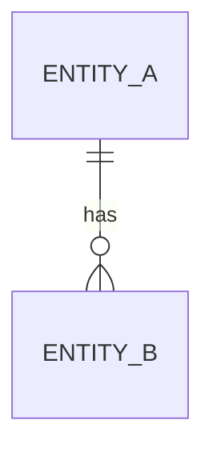

# Database Specification Template

Documents a database schema or a schema change before it is implemented. Copy into `docs/03-engineering/`, rename `DB-NNN-<slug>.md`, replace all `<placeholders>`.

## Front matter for the new document

```yaml
---
id: DB-<NNN>
title: <Schema/area name> Database Spec
status: draft
owner: <owner>
created: <YYYY-MM-DD>
updated: <YYYY-MM-DD>
version: 0.1.0
domain: engineering
tags: [database]
dependencies: [PRD-<NNN>]
related: [API-<NNN>]
---
```

---

# Database Spec: <Name>

## Purpose

What data this schema holds and which PRD(s)/API(s) it serves.

## Engine & Conventions

- **Engine:** <e.g. PostgreSQL 16>
- **Naming:** <e.g. snake_case tables and columns, singular/plural convention>
- **Primary keys:** <e.g. UUID v7 / bigint identity>
- **Timestamps:** <e.g. `created_at`, `updated_at` UTC, set by DB>
- **Soft delete:** <policy or "not used">

## Entity Overview



## Tables

Repeat per table:

### `<table_name>`

<One-line purpose.>

| Column | Type | Null | Default | Notes |
|--------|------|------|---------|-------|
| `id` | uuid | no | generated | PK |
| `<column>` | <type> | <yes/no> | <default> | <constraints, meaning> |
| `created_at` | timestamptz | no | now() | |
| `updated_at` | timestamptz | no | now() | |

**Indexes**

| Name | Columns | Type | Why |
|------|---------|------|-----|
| `<idx_name>` | `<cols>` | btree/unique | <query it serves> |

**Constraints & integrity**

- <FKs, checks, uniqueness rules>

## Access Patterns

| Query | Frequency | Served by |
|-------|-----------|-----------|
| <query description> | <hot/warm/cold> | <index/table> |

## Migration Plan

- **Forward:** <steps, ordering, locks to avoid>
- **Rollback:** <how to undo safely>
- **Backfill:** <if any — batch size, idempotency>

## Data Lifecycle & Compliance

- **Retention:** <how long, why>
- **Sensitive data:** <columns, protection, what must never be logged>

## Open Questions

- [ ] <question — owner>
